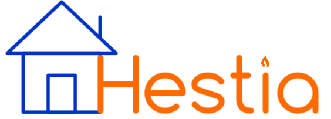
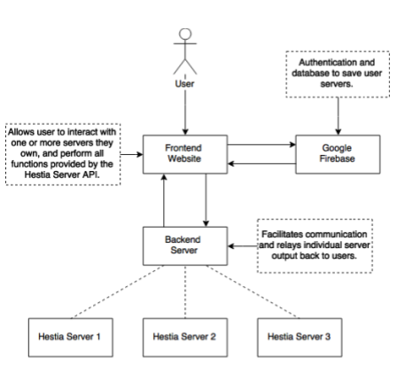
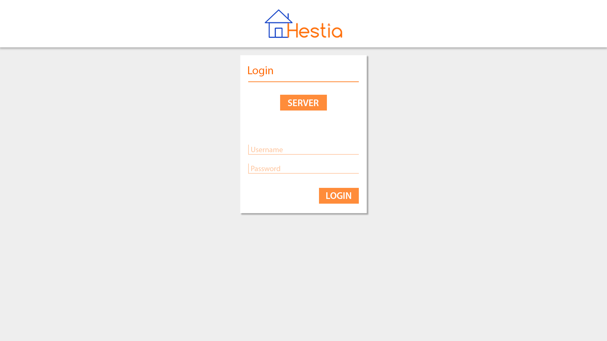
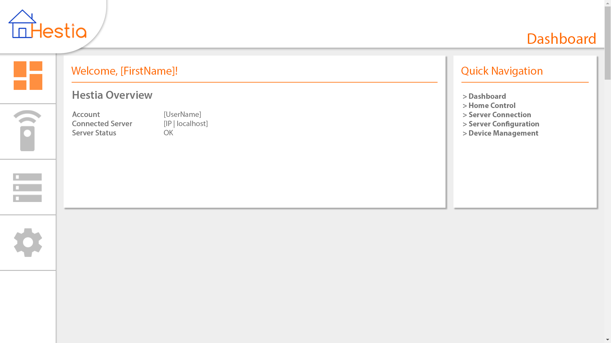
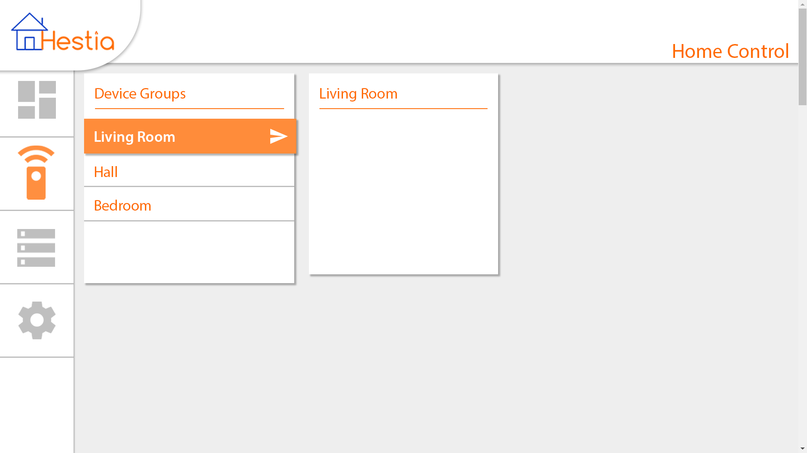
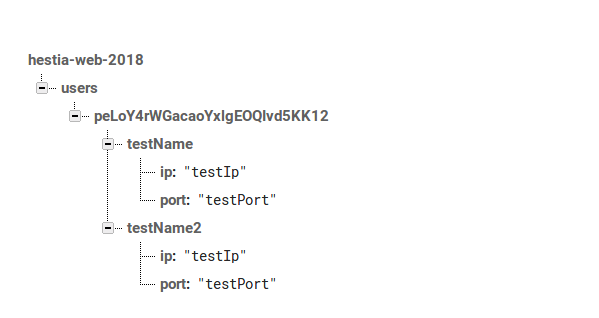

<center>
	<!-- Title image and text. -->
	
	<h1>Hestia Web Development Architecture Document</h1>
	<span style="font-style: italic; color: #b34700">Version 1.0</span>
</center>

### Clients
- F. te Nijenhuis
- L. Holdijk

### Authors
* A. Lalis
* T.K. Harrison
* R.T. Nijman
* P. Oetinger
* N. Dijkema
* E. Abdo
* R. Bell
* S. Oegema

### Teaching Assistant
Feiko Ritsema

## Introduction
The Hestia Home Automation System, developed by the clients, aims to make home automation simple again. The local server infrastructure that facilitates communication and control of the various peripherals in one's home has been implemented by the clients. In addition to this local server, an Android application has been pre-made by the client and is available for reference. As it stands users of Hestia are unable to access their home servers outside of their local network. This coupled with the lack of client side interfacing, limits ease of use and widespread adoption of the Hestia system.

To improve on this, we will develop a web based interface for Hestia. For this, there are two main systems under consideration: the front-end (the user interface with which the client interacts), and the back-end (which serves as a middleman between local Hestia servers and their users).

This document describes the functioning of these systems, their interaction, and the motivation behind their underlying design choices.

### Overview
Our goal for this project is to create a web interface for Hestia. This web interface, which is hosted on a central server, should allow users to log in and connect to their local Hestia servers. This allows users to interact with their home automation system remotely.

A Hestia server is a *controller* that manages a set of *peripherals*. Those peripherals are the facilities to be automated. These could for example be lights, locks, or any number of programmable devices. This is possible because Hestia is designed to be peripheral independent via a plugin infrastructure.

The clients have created this system using the REST API. This decouples our work from the underlying infrastructure of Hestia.

## General Overview of the System
The Hestia Web Interface can be divided into two main sub-systems as mentioned in the introduction.

* Front-end user interface, with which the user interacts
* Back-end server that connects users to their local Hestia controllers and holds user and server information



## Website Front-End
Since the frontend of the website is the first aspect of the product that the customer will interact with, and will be one of the main sources of content or discontent throughout their user experience, a variety of design choices have to be made. 

The website will allow a user to connect to their controllers through a web server, and then manage the devices on their controllers through a range of different controls, and do this in the knowledge that themselves and their information are being kept safe.







### Design choices
Due to the Firebase server, once the user has logged in then they will be able to see devices from every server they own, without having to switch between them. Thus, the main focus of the website will be on listing the devices managed by their controllers, and on the operations that can be applied on them. These will mirror those already implemented by Hestia, such as renaming or deleting a device, but with more streamlined interfacing added, such as using buttons and sliders in order to change the activators of a device, instead of having to directly enter values.


#### Structural choices
The page is laid out in such a way that the user can easily cycle between personal information, their devices, their controllers' information, and settings. Devices are grouped by what controller they belong to which will help reduce complexity, as a large house or an office could have several different controllers. 

#### Aesthetical choices
The design overall will be quite minimalist, with some elements such as colour taken from the Hestia logo. Aside from the main Hestia logo, the icons used are from [Material Icons database](https://material.io/icons/), which provides a large set of intuitive, user friendly icons. 


## Website Back-End
The backend of the webapp will serve as a middleman between the web frontend and the user's controllers. This means that there needs to be an interface to be able to send queries to the server. Furthermore, a user database is required in order to maintain a secure environment in which users may only have permission to interact with systems they own. Unauthorized access to server data, user data, or any other sensitive information is completely forbidden.


### Design decisions
For the design of the webapp we initially chose to implement PHP since there was familiarity in the team with PHP. Thus, a concise webpage was setup using HTML and PHP. This website was designed to test querying a Hestia webserver (for instance a *GET* request). After the initial webpage was created we decided to implement the webpage in Python using Flask. There are two primary reasons for this:

1. The clients are familiar with working with both Python and Flask as they implemented Hestia using these tools.
2. It adds to consistency throughout the Hestia project.
3. Python appears to allow for rapid development with simpler deployment than PHP and Apache server.

However, we are currently unsure on whether Python and Flask will hinder scalable deployment when compared to using PHP.

### Why Not Go Directly From Browser to Controller?
Because the client's website will use javascript to send AJAX requests to the webserver, it is also perfectly capable of sending those requests directly to whatever controller the user wishes to control. However, in practice, this is not recommended, because some browsers, including Firefox, disable *Cross Origin Resource Sharing*. This could potentially be a large security vulnerability, and as such we avoid the issue by adding a layer of abstraction and forcing the user to communicate **only** with the website/webserver as opposed to both the website and the local controller. From Mozilla's website regarding CORS, or security reasons, browsers restrict cross-origin HTTP requests initiated from within scripts. For example, XMLHttpRequest and the Fetch API follow the same-origin policy.

Creating a custom relational database schema and authentication system, and making it secure, is very costly in both time and resources. Since these services are also available through Firebase, we have decided on using Google's Firebase platform for our database needs, as explained in the next section.

### Firebase
[Firebase](https://firebase.google.com/) is a platform that offers a complete and popular backend solution. It offers an authentication service called Firebase Authentication. Users can login using passwords, phone numbers, email, and popular identity providers such as Google and Facebook. Furthermore, Firebase gives a realtime database, which we will use to store users information.

Firebase has free and paid versions, where the free version allows up to 100 simultaneous connections. During development of the Hestia system, this will clearly suffice. However, it has to be considered that a paid plan is going to be required once Hestia grows. Pricing is available through: *https://firebase.google.com/pricing/* 

During development it is essential to design the system in such a way that switching from Firebase to an alternative service does not incur large infrastructural cost.

#### Authentication
We will use Firebase for the initial login process, where the user enters their details. The information regarding each users servers will be stored on firebase, so once the user enters their details, their server(s) will be found and connected to. If the user does not have their information stored already, then a new entry will be made for them with no servers listed.

#### Database
Firebase provides a realtime database solution, in which data is stored in JSON format. We will use this currently to store the information about the servers which the user has. This will have the following layout: there will be an overarching Users section which contains all users, then nested within this there will be each user, identified by their user id. Each user will contain a list of the IP addresses of that users servers. This is quite a simple structure, which will make it easy if (as specified above) we switch to an alternative service. Furthermore, the reason all users are nested within Users is to give the possibility of adding further structures to the database. Since a server may be held by multiple users, there may be some redundancy as servers may be listed more than once, though since the database will be used only to search for users this will not cause inefficiency.



### Functionality of the Webapp
Currently, we have developed a server that serves as the liaison between the Hestia local controller and the user's interface. The front-end website will interact with this server exclusively through sending JSON objects in the payload of POST requests. These objects contain the following information.

* *query*: The endpoint that the client intends to send a request to, on the Hestia local controller.
* *method*: The method by which the user wishes to send the request.
* *payload*: The payload is an optional item in the request that when supplied, is used for requests which require additional information, such as POSTing to /devices/ to create a new device, or updating a device's name. The exact content of the payload is identical in structure to the payload that would naturally be received by the controller.

Every time a query is done on the webpage, the server gets a request where the */request* endpoint is being pinged. The above piece of code breaks down what the information consists of. Firstly, it gets a JSON object, where the *url* variable is set to be the URL, such that it can access either plugins or devices. Secondly, a certain method is set in the data that is being sent, such as GET, POST, PUT, or DELETE. Furthermore, depending on the method, there may be a payload, which contains the *body* of the message. For instance, for posting a new device, this would consist of a name, an ip, and a port number. Also, the corresponding plugin is required, which in this case also has to be part of the message sent from the webapp to our server. This differs from for instance a GET request, which simply requires a URL and the method.

Based on this information we have a function routeRequest, which follows up with the corresponding action, and sends the appropriate data. 
```
def routeRequest(method, query, payload):
	result = ""
	if (method == "GET"):
		result = requests.get(query, verify=False).text
	elif (method == "POST"):
		result = requests.post(query, verify=False, json=payload).text
	elif (method == "PUT"):
		result = requests.put(query, verify=False, json=payload).text
	elif (method == "DELETE"):
		result = requests.delete(query, verify=False).text
	else:
		result = "Invalid REST method."
	return result
```
Currently, the verify flag is set to `False`, as there is no secure connection to the site yet, which obviously has to be changed. What the code above does is, based on the method, it will send a package with corresponding information to the corresponding URL, and return the result of that request back to the client who originally sent the request.


## Glossary
Below are defined terms used in the architecture document:

* *Controller*: The local Hestia server in a user's house. The controller simply runs the Hestia Server previously developed by the client, and has a unique IP address and port number.

* *Peripheral*: A peripheral is any device which can be connected to the Hestia system via a plugin. For example, a Phillips Hue light bulb would constitute a peripheral.

* *User*: A user is someone who has installed a Hestia controller in their home, and accesses the website to control their system.

## Change Log

| Who           |       When | Where          | What                                                                           |
| :---          |       :--- | :---           | :---                                                                           |
| Troy Harrison | 2018-03-12 | Whole document | Created initial document.                                                      |
| Andrew Lalis  | 2018-03-12 | Whole document | Updated content for document.                                                  |
| Rens Nijman   | 2018-03-12 | Front-End      | Add structure for front-end section.                                           |
| Rens Nijman   | 2018-03-12 | Back-End       | Add structure for back-end section.                                            |
| Rens Nijman   | 2018-03-12 | Whole document | More introduction and back-end.                                                |
| Andrew Lalis  | 2018-03-12 | Glossary       | Added glossary.                                                                |
| Phil Oetinger | 2018-03-13 | Whole Document | Cleaned up the grammar, removed redundant sentences, expanded upon some points |
| Roman Bell    | 2018-03-13 | Frontend       | Added content regarding the frontend section                                   |
| Rens Nijman   | 2018-03-13 | Back-end       | Added section on our server's functionality                                    |
| Andrew Lalis  | 2018-03-13 | Back-end       | Revised a few things.                                                          |
| Troy Harrison | 2018-03-13 | Whole Document | Cleaned up document.                                                           |
| Roman Bell    | 2018-03-23 | Whole Document | Added stuff regarding Firebase, cleared up grammar and syntax throughout       |
| Roman Bell    | 2018-04-14 | Overview       | Added diagram								       |

