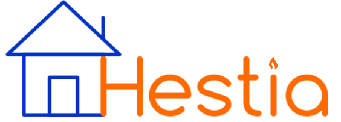

	<!-- Title image and text. -->
	
	<h1>Hestia Web Development Requirements Document</h1>
	Version 1.0

### Clients
- F. te Nijenhuis
- L. Holdijk

### Authors
* A. Lalis
* T.K. Harrison
* R.T. Nijman
* P. Oetinger
* N. Dijkema
* E. Abdo
* R. Bell
* S. Oegema

### Teaching Assistant
Feiko Ritsema

## Introduction
The *Hestia* Home Automation System, developed by the clients, aims to make home automation simple again. The local server based back end infrastructure to facilitate communicating and controlling the various devices connected to that server has been implemented by the clients. However, besides an Android application (also developed by the clients), the system lacks consumer side interfacing. This limits ease of use and hinders widespread popular usage.

Our goal in this project is to develop a web interface to ensure that the users of the Hestia System have a streamlined, usable, and secure experience. In brief, the users of the system should have quick, intuitive access to all the functionality provided by the clients' existing API system, so that anyone can simply navigate to a webpage and have the power to do what one could previously only do through manual HTTP requests. To that end this document details the requirements associated with this project.

## User Stories

The requirements for the system are specified from the perspective of all those who are going to use the system, i.e. via user stories. The user stories involve the description of the user, their requirement, and the reasoning behind that requirement. The user stories reaffirm the context of the requirement and aid in prioritization and re-specification. More user stories will be added as more requirements are discovered throughout the development process and with further consultation with the client.

The actors referenced throughout the aforementioned user stories are defined in more detail below, so that the reasoning for each story is logical and motivated by a realistic desire or need.

#### User
The majority of the stories are focused around the *User*, who is someone who makes use of the Hestia system to automate peripherals in their home. The user does not care about implementation or backend behaviour, as long as their experience with the interface is satisfactory. The user, in general, wants the system to be as intuitive and easy to use as possible, while still providing complete control over the devices in their home.

#### Developer
The *Developer* is one who is responsible for designing the software that the user will interact with. They are most concerned with the structure and design of the system, and must make the application in such a way as to satisfy the user's needs and the clients' goals. Note that the developer in this scenario is not responsible for the pre-existing software provided by the clients.

#### Plugin Developer
The *Plugin Developer* is a person who has created a plugin that the Hestia system can manage. The plugin developer does not need to know a great deal about the user interface in order to develop plugins, and as such is more concerned with being able to publish their plugin and have it work successfully on all other Hestia local systems.

#### Critical user stories
- [x] As a user, I would like to be able to change the status of peripherals of all of my Hestia servers from one location, so that it’s easier for me to configure my home automation.
- [x] As a user, I would like to be able to add a new Hestia server to be remotely controlled.
- [ ] As a user, I would like to be able to ensure that my Hestia servers and their devices cannot be controlled without my knowledge.
  - [ ] As a user, I would like to be able to access a log of events associated with my servers, so that I can see what changes have occurred.
- [ ] As a user, I would like to be able to ensure that my Hestia servers cannot be accessed without my consent.
  - [ ] As a user, I would like to be able to set my authentication credentials, to ensure that I am the only one who can be authenticated by those credentials.
- [x] As a user, I would like to be able to share access to my Hestia server to other people who I trust, so that others who are affected by the peripherals can change things to suit them.
  - [ ] As a user, I would like to be able to set permissions for the servers or peripherals, so that I can limit what people who I have shared access with can do on my servers.
- [x] As a user, I would like to be able to easily add or remove plugins from my Hestia servers, so that it’s easy for me to test various peripherals.
- [ ] As a user, I would like to be able to use the Hestia service without interruption.
  - [ ] As a user, I would like fast responses to any input I make.
- [ ] As a user, I would like to be able to easily add or remove plugins from my Hestia servers, so that it’s easy for me to test various peripherals.
- [x] As a developer, I would like the web front end to communicate to the servers via the REST API, to have consistency in the system.
- [x] As a user, I would like to be able to control my Hestia systems even when I am not on their local network.

#### Important User Stories
- [x] As a user, I would like to be able to view details about my Hestia servers from a central location, so that I can monitor their status easily.
- [ ] As a user, I would like to be able to specify presets across my peripherals and apply those presets, so that I can quickly configure the peripherals to suit my preferences.
- [ ] As a user, I would like to be able to submit feedback to plugin developers, so that they can improve their plugin.
- [ ] As a plugin developer, I would like to be able to receive detailed and organised feedback, so I can improve my plugin.
- [ ] As a user, I would like to be able to be able to be able to put my devices into groups of my choice, in order to be able to find specific devices more easily.

#### Useful User Stories
- [ ] As a user, I would like to be able to donate to plugin developers, to show my support.
- [ ] As a user, I would like to be able to export and import configurations for my Hestia servers, to make it easier for me to deploy my systems.
- [ ] As a user, I would like to be able to specify presets for my peripherals and apply those presets, so that I can quickly configure the peripherals to suit my preferences.
- [ ] As a user, I would like to be able to change the theme of the user-interface, so that it suits my preferences.

## Non-Functional Requirements
- [ ] As a user, I would like to be able to use the Hestia service without interruption.
- [ ] As a developer, I would like to have consistent style between my products.

## Won't Do
Below are listed some requirements or concerns which the clients have told us about, but due to resource requirements, legal issues, or other barriers, we know in advance that such features cannot be reasonably implemented.

* Add secret backdoor access to allow administrators to control the lights in any house where Hestia is installed.
* Make website available by localhost as well as through internet. (Client says this is not necessary, but we realize it would be good to improve accessibility)

## Change Log

| Who            |       When | Where          | What                                                                                              |
| :---           |       :--- | :---           | :---                                                                                              |
| Troy Harrison  | 2018-02-27 | Whole Document | Added initial description, and basic user stories.                                                |
| Rens Nijman    | 2018-02-27 | Whole Document | Fixed typos and separated user stories by importance.                                             |
| Peter Oetinger | 2018-02-27 | Whole Document | Added user stories.                                                                               |
| Andrew Lalis   | 2018-02-27 | Whole Document | Added Hestia Logo, fixed grammar, added changelog. Defined actors for user stories.               |
| Andrew Lalis   | 2018-03-04 | Whole Document | Added TA name, Won't Do section, removed duplicate user story, added non-functional requirements. |
| Andrew Lalis   | 2018-03-12 | Document Name  | Renamed to HestiaWeb_requirements, added local website to Won't Do.                               |
| Rens Nijman    | 2018-03-12 | Won't Do       | Removed a space.                                                                                  |
| Troy Harrison  | 2018-03-13 | Requirements   | Move requirements to better reflect current focus.                                                |
| Roman Bell     | 2018-03-23 | Whole Document | Edited in preparation for final hand in.                                                          |
| Roman Bell     | 2018-03-27 | User stories   | Did checkboxes of features.                                                                       |
